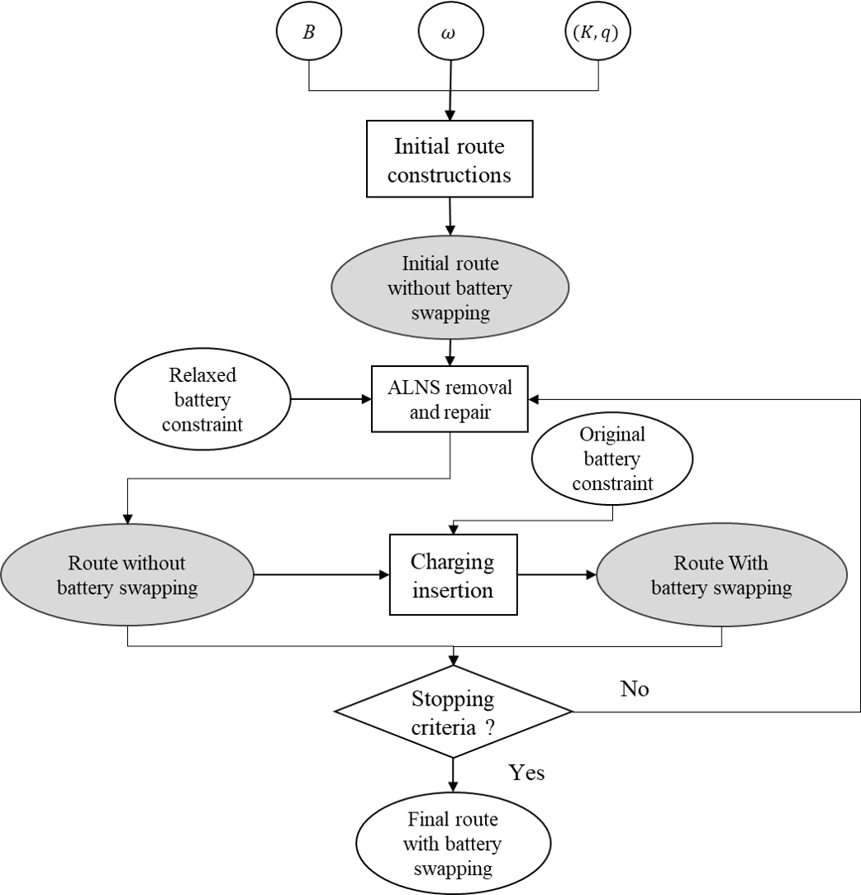
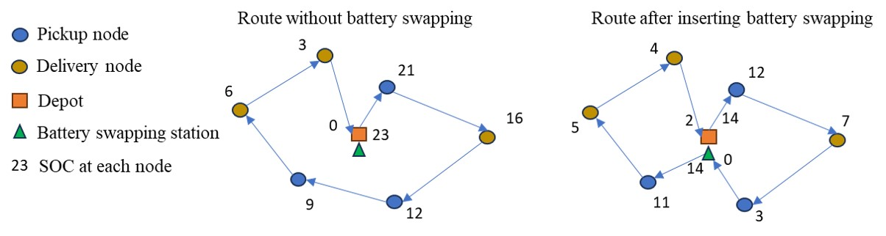

# Two-Stage Stochastic Fleet and Battery Sizing for Sidewalk Delivery Robots

[](https://doi.org/10.1016/j.tre.2025.104220)
[](https://doi.org/10.1016/j.tre.2025.104220)
[](https://doi.org/10.1016/j.tre.2025.104220)


This repository contains the research code and reproducible experiments for:

**Du, Y., Yang, H., Chow, J. Y. J., & Le, T. V. (2025)**
*Two-stage stochastic fleet and battery sizing with routing optimization for sidewalk delivery robots*
Transportation Research Part E, 201, 104220.
https://doi.org/10.1016/j.tre.2025.104220


## Overview

This project addresses **strategic resource planning** for sidewalk delivery robot (SDR) systems under **stochastic demand**, integrating:

- **Fleet sizing** (number of robots)
- **Battery provisioning** (number of swappable batteries)
- **Operational routing** with pickup-delivery time windows and battery swapping

### Two-Stage Stochastic Optimization Framework

**Stage 1 (Strategic)**: Determine fleet size and spare battery inventory before demand realization.
**Stage 2 (Operational)**: Given demand realization, solve routing with soft time windows and battery constraints.

To ensure scalability, the framework combines **continuous approximation (CA)** models with a **customized ALNS heuristic** for the routing subproblem.

<p align="center">
  
  <br>
  <em>Figure 1: Two-stage stochastic optimization framework</em>
</p>


## Methodological Contributions

Contributors: Yuchen Du and Hai Yang(https://github.com/Marshallyangcuhk)

### Problem Setting (SDR-PDPTW)
- Single-depot SDR system operating on sidewalks
- Pickup-delivery orders with **soft time windows** (penalties for delays)
- Limited battery capacity with **at most one battery swap per route**
- Stochastic demand modeled as Poisson process

### Stage 2: Routing Heuristic (ALNS)
Our custom **Adaptive Large Neighborhood Search (ALNS)** includes:

**Removal Operators:**
- SISR (Stochastic Insertion with Sequential Removal)
- Shaw removal (similarity-based)
- Random removal
- Worst removal (cost-based)

**Repair Operators:**
- Greedy insertion
- Regret-k insertion

**Key Features:**
- Order-only routing with relaxed battery constraints
- Explicit battery-swapping insertion after route optimization
- Simulated annealing acceptance
- Adaptive operator weight adjustment

<p align="center">
  
  <br>
  <em>Figure 2: Battery swapping insertion mechanism</em>
</p>

### Stage 1: Continuous Approximation Model
Instead of classical SAA, we fit a CA-based surrogate model from sampled Stage 2 solutions:
- Approximates expected routing distance + delay penalties
- Function of: demand level, fleet size, battery availability
- Enables fast evaluation of thousands of (fleet, battery) combinations


## 📂 Repository Structure

```
VRP-heuristics/
├── paper-code/              # ⭐ Core research code (validated & tested)
│   ├── data/
│   │   ├── purdue_node_info.csv    # Campus nodes (51 locations)
│   │   └── tt_matrix.csv            # Time/distance matrix
│   ├── results/
│   │   └── sensitivity_analysis_*.csv  # Experimental results
│   ├── tests/                       # Validation suite (4/4 passing)
│   │   ├── run_all_tests.py
│   │   └── test_*.py                # Component tests
│   ├── real_map.py                  # Map data loading
│   ├── demands.py                   # Stochastic demand generation
│   ├── order_info.py                # Order table with time windows
│   ├── instance.py                  # PDPTWInstance class
│   ├── solution.py                  # PDPTWSolution + feasibility
│   ├── operators.py                 # ALNS operators (SISR here)
│   ├── solvers.py                   # ALNS main algorithm
│   ├── test.ipynb                   # Main experiments
│   ├── sensitivity_test.ipynb       # Sensitivity analysis
│   └── README.md                    # Detailed code documentation
│
└── vrp-toolkit/             # 🚧 Framework development (ongoing)
    ├── vrp_toolkit/         # Generalized VRP framework
    │   ├── problems/        # Problem definitions (PDPTW, VRP, CVRP)
    │   ├── algorithms/      # Algorithms (ALNS, future: GA, Tabu)
    │   ├── data/           # Data generation + OSMnx integration
    │   └── visualization/   # Route plotting
    ├── tutorials/           # 7 Jupyter notebook tutorials
    ├── playground/          # Interactive Streamlit app
    └── tests/              # 40+ unit tests
```

## 🚀 Quick Start

### Prerequisites
```bash
pip install numpy pandas matplotlib networkx
```

### Validate Installation
```bash
cd paper-code/tests
python run_all_tests.py
# Expected: 4/4 tests passing in ~6 seconds
```

### Run Example Experiment
```python
from real_map import RealDataMap
from demands import DemandGenerator
from order_info import OrderGenerator
from instance import PDPTWInstance
from solvers import greedy_insertion_init, ALNS

# Load Purdue campus data
real_map = RealDataMap('data/purdue_node_info.csv', 'data/tt_matrix.csv')

# Generate stochastic demand
demand_gen = DemandGenerator(
    time_range=240,      # 4-hour time horizon
    time_step=30,        # 30-minute intervals
    restaurants=real_map.restaurants,
    customers=real_map.customers,
    random_params={'sample_dist': ..., 'demand_dist': ...}
)

# Create order table with time windows
order_gen = OrderGenerator(real_map, demand_gen.demand_table, time_params, robot_speed=1.0)

# Formulate PDPTW instance
instance = PDPTWInstance(order_gen.order_table)

# Solve with ALNS
initial_solution = greedy_insertion_init(
    instance,
    num_vehicles=5,
    vehicle_capacity=10,
    battery_capacity=100,
    battery_consume_rate=0.5,
    penalty_unvisit=1000,
    penalty_delay=100
)

alns = ALNS(
    initial_solution=initial_solution,
    params_operators=...,  # Removal/repair weights
    dist_matrix=instance.distance_matrix,
    battery=battery_capacity,
    max_no_improve=100,    # Stopping criterion
    segment_length=100,    # Iterations per segment
    num_segments=10        # Total segments
)

best_solution = alns.run()
print(f"Objective value: {best_solution.objective_function()}")
```

See **`paper-code/test.ipynb`** for complete working examples.


## Reproducibility & Validation

### Test Suite Status
All components validated with automated tests:

```bash
cd paper-code/tests
python run_all_tests.py
```

See `paper-code/tests/TEST_SUMMARY.md` for detailed results.

### Case Study: Purdue University Campus
- **Network**: 51 nodes extracted from OSM data
- **Scenario**: Restaurant delivery to campus buildings
- **Sensitivity Analysis**: Demand level, fleet size, battery range
- **Results**: Available in `paper-code/results/`

<p align="center">
  
  <br>
  <em>Figure 3: Purdue University campus delivery network with 51 nodes</em>
</p>

Run `paper-code/sensitivity_test.ipynb` to reproduce experiments.


## Key Results

The paper demonstrates:

1. **ALNS Efficiency**:
   - Solves 100-order instances in few minutes
   - Within 5% of MIP lower bound on small instances
   - Scales to realistic problem sizes (200+ orders)

2. **Two-Stage Framework**:
   - CA model reduces computational time vs. sample average approximation
   - Enables comprehensive sensitivity analysis
   - Identifies trade-offs between fleet cost and service quality

3. **Purdue Case Study**:
   - Optimal configuration
   - Battery swapping reduces fleet requirement
   - Soft time windows reduce total cost


<p align="center">
  
  <br>
  <em>Figure 4: Example routing solution with battery swapping</em>
</p>

See paper for complete experimental results and analysis.

---

## Development Notes

### Paper Code (`paper-code/`)
- **Status**: ✅ Validated and fully tested
- **Purpose**: Reproduce paper experiments
- **Use Case**: Academic research, benchmarking, citation

### VRP Toolkit (`vrp-toolkit/`)
- **Status**: 🚧 Framework development (95% complete)
- **Purpose**: Generalized VRP framework for research and education
- **Features**:
  - Three-layer architecture (Problem/Algorithm/Data)
  - OSMnx integration for real-world maps
  - 7 progressive tutorials
  - Interactive playground (Streamlit app)
  - 40+ unit tests

The toolkit is being developed to enable:
- Easy extension to new VRP variants
- Algorithm comparison and benchmarking
- Educational use in courses
- Rapid prototyping for new research

For development documentation, see [`.claude/CLAUDE.md`](.claude/CLAUDE.md).

---

## 📖 Citation

If you use this code or build upon this work, please cite:

```bibtex
@article{du2025two,
  title   = {Two-stage stochastic fleet and battery sizing with routing optimization for sidewalk delivery robots},
  author  = {Du, Yuchen and Yang, Hai and Chow, Joseph Y. J. and Le, Tho V.},
  journal = {Transportation Research Part E},
  volume  = {201},
  pages   = {104220},
  year    = {2025},
  doi     = {10.1016/j.tre.2025.104220}
}
```

---

## Contributing

This repository serves dual purposes:

1. **Reproducible Research** (`paper-code/`): Stable reference implementation
2. **Framework Development** (`vrp-toolkit/`): Ongoing engineering work

Contributions are welcome for:
- Bug reports and fixes in `paper-code/`
- Framework enhancements in `vrp-toolkit/`
- Additional tutorials and examples
- Integration with other VRP algorithms

See individual directory READMEs for specific guidelines.

## License

This code is provided for academic and research purposes. Please cite the paper if you use this code in your research.

## Authors

This work is authored by Du, Y., Yang, H., Chow, J. Y. J., & Le, T. V.

**Code Repository Maintainer:** Yuchen Du

For questions about the research or code implementation, please open an issue in this repository.

## Links

- 📄 [Paper (Transportation Research Part E)](https://doi.org/10.1016/j.tre.2025.104220)
- 💻 [Research Code Documentation](paper-code/README.md)
- 🛠️ [VRP Toolkit Documentation](vrp-toolkit/README.md)
- 🧪 [Test Results](paper-code/tests/TEST_SUMMARY.md)

---

**Last Updated**: 2026-01-12
